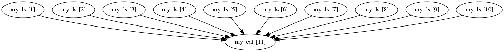
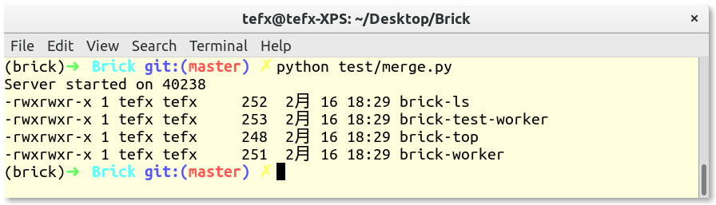

# Brick
scripting and running scientific workflows in Python.

Support processor/container/VM as environments, support local machine, cluster, IaaS and CaaS as service provider.

**The project is in its very early stage.**

test/MoWSC/test.py is a real-world example which I use to run my paper experiments.

Following is a simple example.

# Example

This example is taken from https://pegasus.isi.edu/documentation/examples/, the merge workflow.

Additionally， we made a few changes:

1. the `dirs` is not fixed as in Pegasus example, but is dynamically parsed from PATH env in current system.

2. We add filter after all tasks having completed to find only `brick-*` commands.

```Python
from Brick import Workflow
from Brick.engine import SingleEngine
from Brick.provider.local import ProcessProvider
import sh, os

dirs = filter(os.path.exists, os.environ["PATH"].split(":"))

@SingleEngine(ProcessProvider())
def merge(dirs):
    w = Workflow()

    @w.create_task()
    def my_ls(i, d):
        file_name = "bin_%d.txt" % i
        sh.ls("-l", d, _out=file_name)
        return file_name

    @w.create_task()
    def my_cat(files):
        return str(sh.cat(*files))

    return my_cat([my_ls(i, d) for i, d in enumerate(dirs)])

for line in merge(dirs).splitlines():
    if "brick" in line:
        print line
```


Brick can automatically generate dot file of the application's DAG, like

    file "merge.dot":

    digraph {
        "my_ls-[1]"->"my_cat-[11]"
        "my_ls-[2]"->"my_cat-[11]"
        "my_ls-[3]"->"my_cat-[11]"
        "my_ls-[4]"->"my_cat-[11]"
        "my_ls-[5]"->"my_cat-[11]"
        "my_ls-[6]"->"my_cat-[11]"
        "my_ls-[7]"->"my_cat-[11]"
        "my_ls-[8]"->"my_cat-[11]"
        "my_ls-[9]"->"my_cat-[11]"
        "my_ls-[10]"->"my_cat-[11]"
    }

Then, it can be plotted by the dot command

    dot -Tpng merge.dot -o merge.png

the image is like:



It can be run as normal Python program:



Also, one can get the runtime information of each task in file "merge.run" and "merge.time" after the execution.

# Gallery

Now, supports basic monitoring and analysis feature.

Monitoring the execution of workflow using `brick-top` command:


Monitoring the execution of workflow using `brick-ls` command:


Analyzing runtime information using `brick-stat` command: start time/finish time/running time of tasks.


Analyzing runtime information using `brick-stat` command: tasks completed by time.


Analyzing runtime information using `brick-stat` command: running time of tasks on different services.


