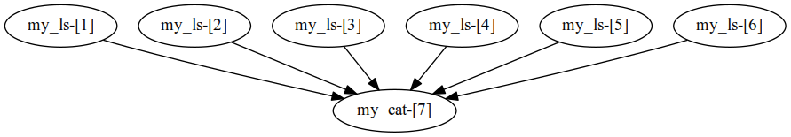

# Brick
scripting and running scientific workflows in Python

test/MoWSC/test.py is a real-world example which I use to run my paper experiments.

Following is a simple example.

# Example

    from Brick import Workflow
    from Brick.engine import SingleEngine
    from Brick.provider.local import ProcessProvider
    import sh, os

    dirs = filter(os.path.exists, os.environ["PATH"].split(":"))

    @SingleEngine(ProcessProvider())
    def merge(dirs):
        w = Workflow()

        @w.create_task()
        def my_ls(i, d):
            file_name = "bin_%d.txt" % i
            sh.ls("-l", d, _out=file_name)
            return file_name

        @w.create_task()
        def my_cat(files):
            return str(sh.cat(*files))

        return my_cat([my_ls(i, d) for i, d in enumerate(dirs)])

    if __name__ == '__main__':
        for line in merge(dirs).splitlines():
            if "brick" in line:
                print line

Brick can automatically generate dot file of the application's DAG, like

    file "merge.dot":

    digraph {
        "my_ls-[1]"->"my_cat-[11]"
        "my_ls-[2]"->"my_cat-[11]"
        "my_ls-[3]"->"my_cat-[11]"
        "my_ls-[4]"->"my_cat-[11]"
        "my_ls-[5]"->"my_cat-[11]"
        "my_ls-[6]"->"my_cat-[11]"
        "my_ls-[7]"->"my_cat-[11]"
        "my_ls-[8]"->"my_cat-[11]"
        "my_ls-[9]"->"my_cat-[11]"
        "my_ls-[10]"->"my_cat-[11]"
    }

Then, it can be plotted by the dot command

    dot -Tpng merge.dot -o merge.png

the image is like:

